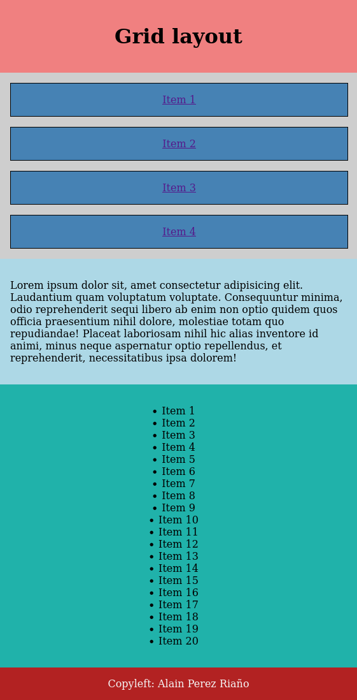
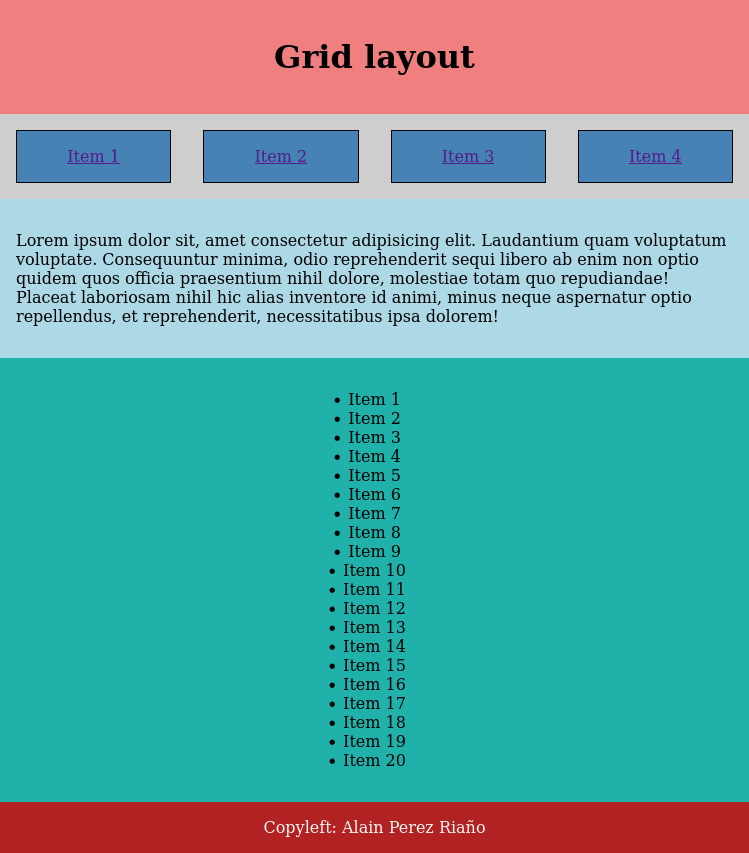
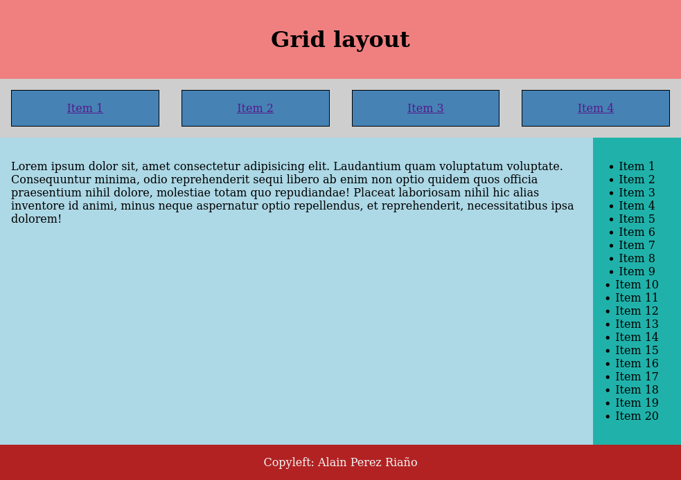
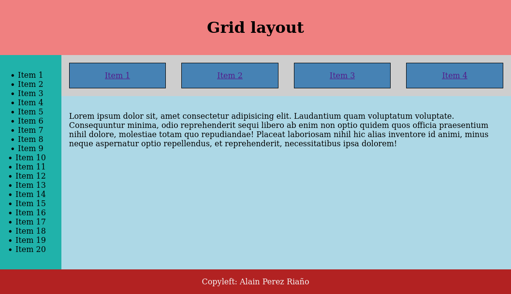
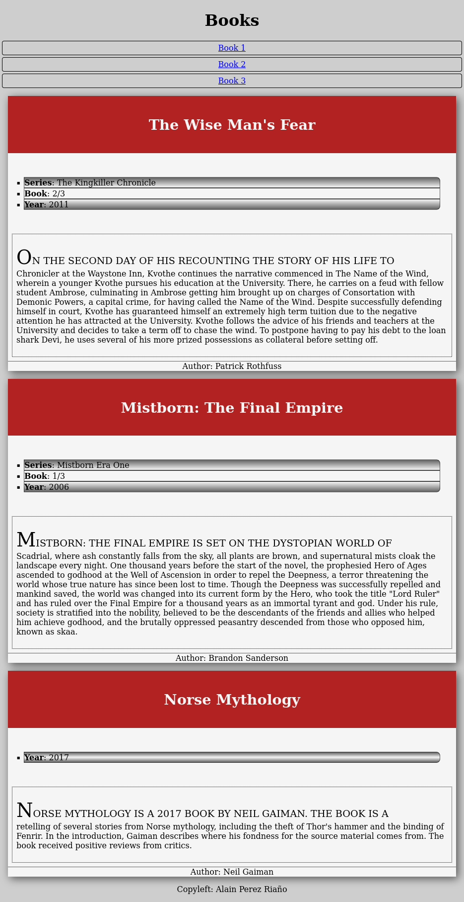
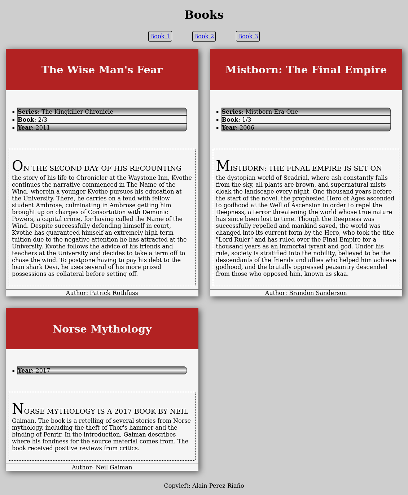
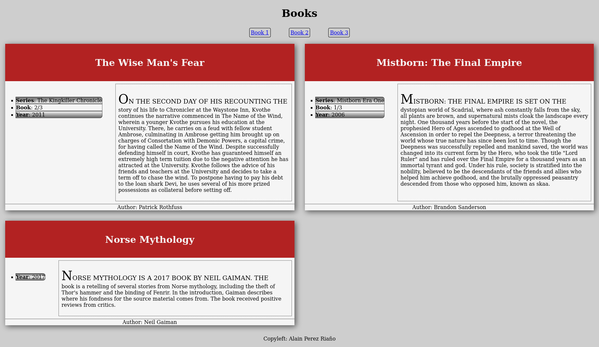
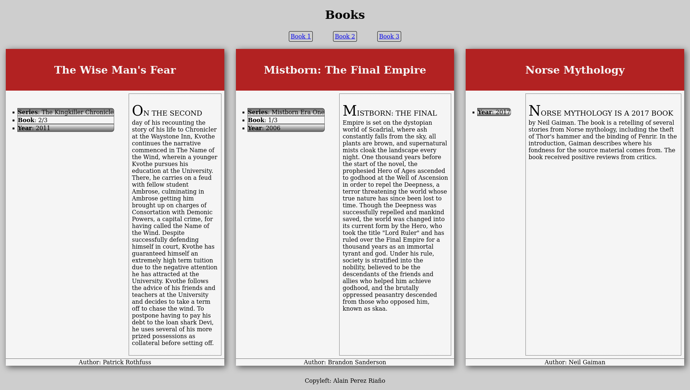

# Grid exercises

## Exercise 1

* Do the following layout adapting to different screen sizes.
* Follow a mobile 1st design.

### Small layout

* All elements show below the others.
* No flexbox or Grid is needed.

### Medium layout

* When screens are larger than 576px, navigation should change to horizontal.

### Large layouts

* Navigation should continue being the same as in medium layout, but change the main layout so it uses Grid (you can add/remove containers if needed).
* Aside should occupy just the needed width.
* Navigation should occupy just the needed height.

### Very large layouts

* We will change the order of the aside for large layouts (>1024px).

## Exercise 2

* Base on book list exercise.
* You can change HTML as needed.
* Follow a mobile 1st design.

### Small views

* Should show all the books in a column.
* No flexbox nor grid is needed.
* Navigation should be as a column.

### Medium views (>1024px)

* Book cards should appear in a grid with 2 columns.
* Navigation should apear as in flexbox exercise.

### Large views (>1200px)

* Cards layout has changed, use grid for that.

### Very large views (>1900px)

* Book cards should appear in a grid with 3 columns.

